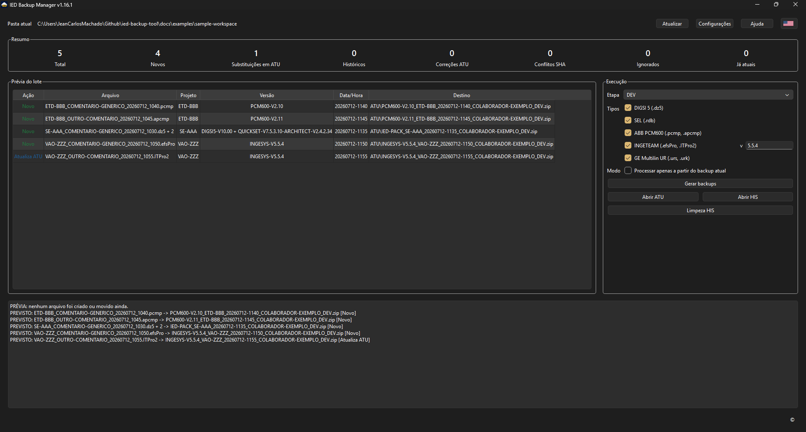
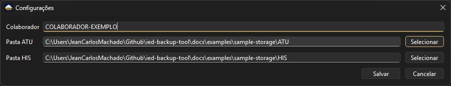
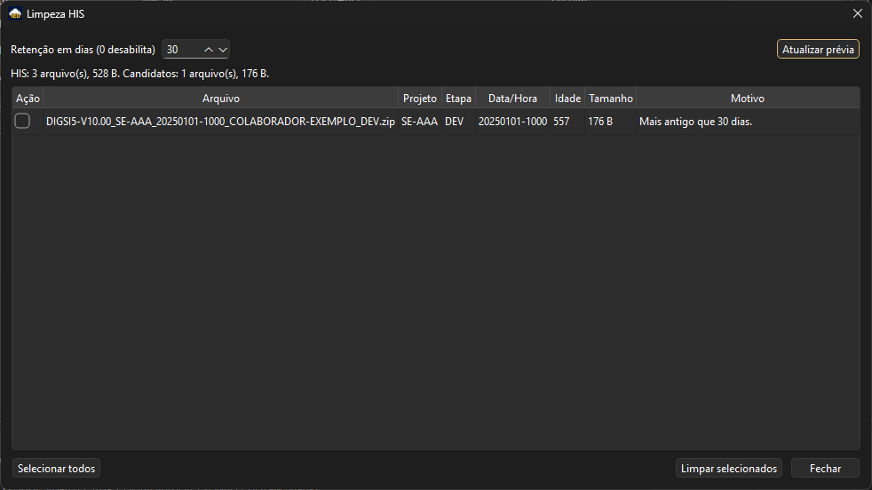
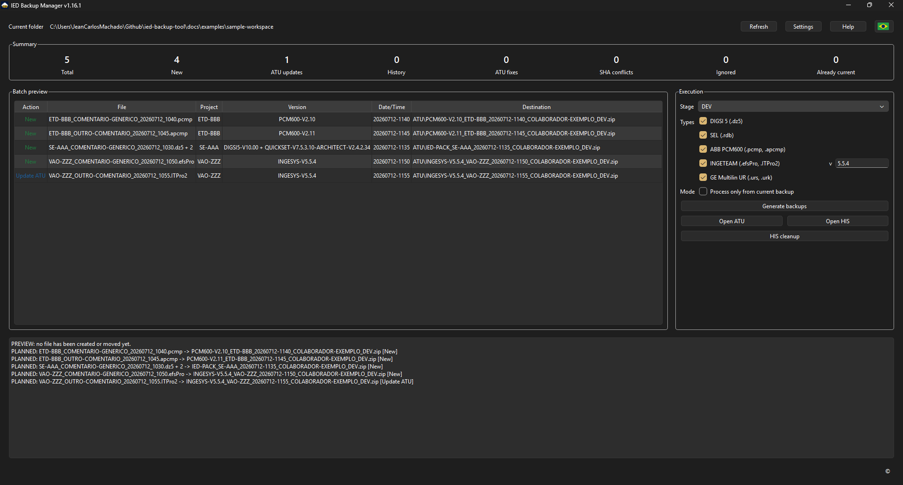

# IED Backup Manager

Aplicação Windows para padronizar backups de projetos de IED, mantendo um backup
atual em `ATU`, histórico em `HIS` e nomes de arquivo consistentes para
rastreabilidade técnica.

Versão atual: `1.15.1`

- Manual do executável: [docs/USO_EXECUTAVEL.md](docs/USO_EXECUTAVEL.md)
- Ajuda operacional: [docs/HELP.md](docs/HELP.md)
- Lógica de identificação dos IEDs: [docs/LOGICA_IDENTIFICACAO_IEDS.md](docs/LOGICA_IDENTIFICACAO_IEDS.md)
- Plano de melhorias: [docs/PLANO_MELHORIAS.md](docs/PLANO_MELHORIAS.md)
- Arquivos públicos de exemplo: [docs/examples](docs/examples)
- Como contribuir: [CONTRIBUTING.md](CONTRIBUTING.md)

## Visão Geral

O IED Backup Manager processa os arquivos de trabalho que estão na pasta do
executável, identifica o projeto pelo trecho antes do primeiro sublinhado `"_"`,
gera um ZIP padronizado e aplica as regras de versionamento entre `ATU` e `HIS`.

O objetivo é reduzir backups manuais inconsistentes, evitar duplicidades
técnicas, preservar histórico e facilitar auditoria sem exigir que o usuário
renomeie manualmente os arquivos finais.

## Interface

Tela principal com prévia do lote, resumo, seleção de tipos de IED, etapa e
destino compacto:



Configuração do colaborador e das pastas de armazenamento:



Limpeza controlada da pasta `HIS`, sempre com prévia e confirmação manual:



Exemplo da interface em inglês:



## Principais Recursos

- Interface grafica para Windows com pré-visualização antes da execução.
- Tela inicial de instruções com opção `Não exibir novamente`.
- Interface em português e inglês, com preferência salva em `config.json`.
- Verificação automática de nova versão publicada no GitHub.
- Download direto do executável mais recente pelo aviso de atualização.
- Executável distribuído com nome fixo `IED_Backup_Manager.exe`.
- Etapas padrão: `DEV`, `PRE-TAF`, `TAF`, `POS-TAF`, `PRE-TAC`, `TAC`,
  `POS-TAC` e descrição livre.
- Processamento individual ou agrupado por subestação/projeto.
- Pacote `IED-PACK` quando mais de um tipo de IED selecionado pertence ao mesmo
  projeto.
- Suporte a GE Multilin / EnerVista UR por pasta de SE, incluindo somente
  subpastas de IED com `.urs` ou `.urk`.
- Metadados `IEDS-BACKUP-INFO.txt` em todos os ZIPs.
- Registro de versões detectadas, arquivos incluídos, tamanho, data de
  modificação e SHA256 dos arquivos de origem.
- Alerta de integridade para mesma identidade técnica com SHA256 divergente.
- Validação das pastas `ATU` e `HIS`, com criação assistida quando faltarem.
- Aviso para pastas sincronizadas, como OneDrive ou SharePoint.
- Atualização automática de `ATU` e arquivamento do backup anterior em `HIS`.
- Escrita mais transacional, com ZIP validado antes de publicar o backup final.
- Quarentena operacional `IED-QUARENTENA` para falhas raras de cópia ou
  movimentação.
- Limpeza controlada de `HIS`, com retenção em dias, prévia, confirmação e
  preservação do backup mais recente por etapa.
- Detecção de duplicidades em `ATU`, com indicação do arquivo problemático.
- Progresso real por arquivo durante compactação e cópia para `ATU`/`HIS`.
- Execução em worker dedicado para manter a GUI responsiva.
- Cancelamento controlado antes de iniciar o próximo arquivo.
- Botão `Ajuda` / `Help` apontando para a documentação operacional pública.
- Indicador `©` com autoria, licença e link do repositório.

## Tipos Suportados

| Tipo | Extensões | Versão no backup |
| --- | --- | --- |
| Siemens DIGSI | `.dz5` | Detectada por marcador interno `.dp4v###` ou `.dp5v###`, gerando prefixos como `DIGSI5-V10.00`. |
| SEL QuickSet / Architect | `.rdb`, com `.scd` ou `.selaprj` opcional | QuickSet e Architect, quando encontrados, gerando prefixos como `QUICKSET-V7.5.3.10-ARCHITECT-V2.4.2.34`. |
| ABB PCM600 | `.pcmp`, `.apcmp` | Detectada em `ProjectDataServer%versions.ini`, gerando prefixos como `PCM600-V2.10`. |
| INGETEAM INGESYS | `.efsPro`, `.ITPro2` | Informada manualmente pelo usuário é salva em `config.json`, gerando prefixos como `INGESYS-V5.5.4`. |
| GE Multilin / EnerVista UR | pastas com `.urs` ou `.urk`; `.ENV` opcional | Usa a maior versão `GE UR Setup` encontrada em `.cid/.icd`, gerando prefixos como `GE-URSETUP-V8.61`; se não houver SCL, usa a maior versão `GEMULTILIN` dos headers `.urs/.urk`. |

## Regra de Nome dos Arquivos

O projeto/subestação é identificado pelo texto antes do primeiro sublinhado
`"_"`.

Exemplos:

```text
SE-AAA_COMENTARIO-GENERICO_20260712_1030.dz5 -> Projeto: SE-AAA
ETD-BBB_OUTRO-COMENTARIO.rdb                 -> Projeto: ETD-BBB
VAO-ZZZ_COMENTARIO-GENERICO_20260712_1050.efsPro -> Projeto: VAO-ZZZ
```

Todo texto depois do primeiro sublinhado `"_"` é tratado como comentário do
usuário e não entra na chave técnica do backup.

Evite:

```text
SE_AAA_20260712_1030.dz5
CLIENTE_SE-AAA_20260712_1030.dz5
DEV_SE-AAA_20260712_1030.dz5
```

Nesses casos, o projeto pode ser identificado incorretamente.

## Nome dos Backups

O nome final segue o padrão:

```text
SOFTWARE_PROJETO_DATAHORA_COLABORADOR_ETAPA.zip
```

Exemplos:

```text
DIGSI5-V10.00_SE-AAA_20260712-1030_COLABORADOR-EXEMPLO_TAF.zip
QUICKSET-V7.5.3.10-ARCHITECT-V2.4.2.34_ETD-BBB_20260712-1035_COLABORADOR-EXEMPLO_TAF.zip
PCM600-V2.10_SE-DDD_20260712-1040_COLABORADOR-EXEMPLO_TAF.zip
INGESYS-V5.5.4_VAO-ZZZ_20260712-1050_COLABORADOR-EXEMPLO_TAF.zip
GE-URSETUP-V8.61_SE-AAA_20260712-1100_COLABORADOR-EXEMPLO_TAF.zip
IED-PACK_SE-AAA_20260712-1035_COLABORADOR-EXEMPLO_TAF.zip
```

## Configuração

O `config.json` fica ao lado do executável. A interface pode criar ou atualizar
esse arquivo pela tela `Configurações`.

Exemplo:

```json
{
  "colaborador": "COLABORADOR-EXEMPLO",
  "atu_path": "C:/Backups/Exemplo/ATU",
  "his_path": "C:/Backups/Exemplo/HIS",
  "language": "pt_BR",
  "project_types": ["digsi5", "sel", "pcm600", "ingeteam", "ge_multilin"],
  "software_versions": {
    "ingeteam": "5.5.4"
  },
  "show_startup_instructions": true,
  "history_cleanup": {
    "retention_days": 30
  }
}
```

## Fluxo de Uso

1. Coloque o executável na pasta dos arquivos de trabalho.
2. Configure colaborador, `ATU`, `HIS`, idioma e tipos de IED.
3. Selecione a etapa.
4. Confira a `Prévia do lote`.
5. Clique em `Gerar backups`.
6. Aguarde a conclusão ou cancele antes do próximo arquivo.
7. Quando necessário, use `Limpeza HIS` para revisar candidatos antes de apagar.

Na coluna `Destino`, a prévia mostra um caminho compacto, como
`ATU\arquivo.zip` ou `HIS\arquivo.zip`. O caminho completo fica no tooltip da
célula.

## Estados de Processamento

- `stored`: novo backup salvo em `ATU`.
- `replaced_current`: backup anterior movido para `HIS` e novo backup salvo em
  `ATU`.
- `archived_history`: backup antigo salvo em `HIS` porque estava faltando no
  histórico.
- `atu_duplicate`: duplicidade encontrada em `ATU`; a GUI mostra o arquivo
  problemático e pergunta se deve mover para `HIS`.
- `sha_conflict`: existe backup com a mesma identidade técnica, mas SHA256
  diferente dos arquivos de origem; a execução fica bloqueada até verificação.
- `skipped_older`: arquivo ignorado porque já existe backup mais recente em
  `ATU`.
- `already_current`: arquivo já corresponde ao backup atual em `ATU`.

## Exemplos Públicos

A pasta [docs/examples](docs/examples) contém arquivos artificiais para testes,
prints e demonstrações públicas. Eles cobrem DIGSI, SEL, PCM600, INGETEAM e
GE Multilin, além de uma estrutura `ATU`/`HIS` para demonstrar a tela
`Limpeza HIS`.

Executar a GUI com os exemplos:

```powershell
.\.venv\Scripts\python.exe -m src.gui.app --project-dir ".\docs\examples\sample-workspace"
```

Nas configurações, use:

```text
Colaborador: COLABORADOR-EXEMPLO
Pasta ATU: docs\examples\sample-storage\ATU
Pasta HIS: docs\examples\sample-storage\HIS
```

Para INGETEAM, use a versão manual `5.5.4`.

Os exemplos não contêm dados reais de engenharia e não devem ser usados como
referência técnica dos formatos dos fabricantes.

## Download

O executável publicado usa sempre o mesmo nome:

```text
IED_Backup_Manager.exe
```

Link fixo para baixar o último executável publicado:

```text
https://github.com/machado-jean/ied-backup-tool/releases/latest/download/IED_Backup_Manager.exe
```

## Desenvolvimento

Criar ambiente:

```powershell
python -m venv .venv
.\.venv\Scripts\python.exe -m pip install -r requirements.txt
```

Executar a GUI em desenvolvimento:

```powershell
.\.venv\Scripts\python.exe -m src.gui.app
```

Executar via CLI:

```powershell
.\.venv\Scripts\python.exe -m src.main --project-dir ".\docs\examples\sample-workspace" --process-all --collaborator "COLABORADOR-EXEMPLO" --atu-path ".\docs\examples\sample-storage\ATU" --his-path ".\docs\examples\sample-storage\HIS"
```

Simular sem criar ZIP nem mover arquivos:

```powershell
.\.venv\Scripts\python.exe -m src.main --project-dir ".\docs\examples\sample-workspace" --project-type sel --process-all --dry-run --collaborator "COLABORADOR-EXEMPLO" --atu-path ".\docs\examples\sample-storage\ATU" --his-path ".\docs\examples\sample-storage\HIS"
```

Validar qualidade e testes:

```powershell
.\.venv\Scripts\python.exe -m ruff check .
.\.venv\Scripts\python.exe -m pytest
```

Gerar executável:

```powershell
.\scripts\release.ps1
```

## Arquitetura

```text
src/core/
  backup_service.py      Regras principais de planejamento e execução
  backup_planner.py      Prévia e decisão ATU/HIS
  backup_executor.py     Execução dos planos de backup
  storage.py             Regras de armazenamento, ATU/HIS e quarentena
  history_cleanup.py     Politica de limpeza controlada de HIS
  project_types/         Adaptadores por fabricante/software

src/gui/
  app.py                 Entrada da aplicação grafica
  main_window.py         Janela principal
  settings_window.py     Configurações
  history_cleanup_window.py Limpeza HIS
  backup_worker.py       Execução em worker Qt
```

Para adicionar outro tipo de IED, crie um novo adaptador em
`src/core/project_types/` com extensões suportadas, identificador de projeto,
software/versão e arquivos relacionados. Depois registre o adaptador em
`src/core/project_types/registry.py`.

## Cuidados de Privacidade

Não publique arquivos reais de backup, `config.json` local, caminhos internos de
empresa ou nomes reais de colaboradores. Para exemplos públicos, use nomes como
`SE-AAA`, `ETD-BBB`, `VAO-ZZZ` e `COLABORADOR-EXEMPLO`.

As pastas locais `IED-DES/`, `IED-ATU/`, `IED-HIS/`, `config.json`, `.venv/`,
`build/`, `dist/`, `.spec` e `releases/` ficam protegidas pelo `.gitignore`.

## Roadmap

Proximos marcos:

- Melhorar experiência operacional conforme surgirem testes reais e feedback de
  usuários.
- Adicionar novos tipos de IED apenas quando surgirem arquivos reais de teste,
  limpos ou sanitizados, com regras confiáveis de identificação de versão.

Consulte [docs/PLANO_MELHORIAS.md](docs/PLANO_MELHORIAS.md) para detalhes.

## Contribuicoes

Contribuicoes são bem-vindas para correções, documentação, testes, exemplos
públicos e suporte a novos tipos de IED.

Antes de abrir uma issue ou pull request, leia
[CONTRIBUTING.md](CONTRIBUTING.md). O projeto possui templates para reportar
bugs, sugerir melhorias, propor novos tipos de IED e abrir pull requests.

Arquivos de exemplo so devem ser enviados quando forem artificiais, limpos ou
sanitizados. Não envie backups com informações confidenciais, dados reais de
cliente/projeto/subestação, IPs, usuários, credenciais, caminhos internos,
ajustes ou lógicas operacionais.

## Licença

Este projeto é disponibilizado sob a **IED Backup Manager Non-Commercial
License**.

Uso gratuito, estudo, auditoria, modificação e uso interno não comercial são
permitidos. Uso comercial, revenda, sublicenciamento, oferta como serviço pago
ou incorporação em produto/serviço comercial não são permitidos sem autorização
prévia por escrito do autor.

A atribuição ao autor original, Jean Carlos Machado, deve ser preservada.

Leia o arquivo [LICENSE](LICENSE) para os termos completos.
