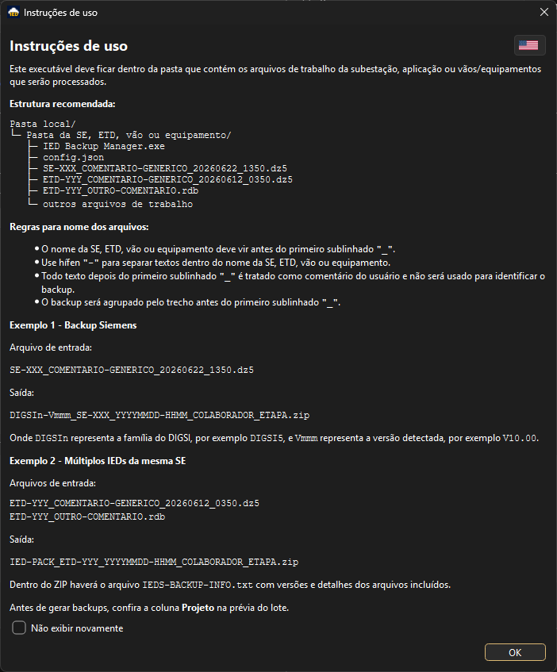

# IED Backup Manager - Help

[Português](HELP.md) | [English](HELP.en.md)

Este documento resume o uso operacional do IED Backup Manager. Ele usa apenas
exemplos genéricos para que possa ser publicado junto do projeto.

Para entender como cada tipo de IED é identificado, quais arquivos entram no
ZIP e como a versão é definida, consulte
[LOGICA_IDENTIFICACAO_IEDS.md](LOGICA_IDENTIFICACAO_IEDS.md).

## Objetivo

O IED Backup Manager padroniza backups de projetos de IED. Ele identifica os
arquivos de trabalho na pasta local, gera ZIPs com nomes consistentes, mantém o
backup atual em `ATU` e arquiva backups anteriores em `HIS`.

## Interface

Tela principal com prévia do lote, resumo, seleção de tipos de IED, etapa e
destino compacto:


Configuração do colaborador e das pastas de armazenamento:


Limpeza controlada da pasta `HIS`, sempre com prévia e confirmação manual:


Tela de instruções exibida na primeira abertura:



Exemplo da interface em inglês:


## Estrutura Recomendada

O executável deve ficar dentro da pasta que contém os arquivos de trabalho da
subestação, aplicação, vão ou equipamento.

```text
Pasta local/
+-- Pasta da SE, ETD, vão ou equipamento/
    +-- IED Backup Manager.exe
    +-- config.json
    +-- SE-AAA_COMENTARIO-GENERICO_20260622_1350.dz5
    +-- ETD-BBB_OUTRO-COMENTARIO.rdb
    +-- ETD-BBB_OUTRO-COMENTARIO.scd
    +-- VAO-ZZZ_COMENTARIO-GENERICO_20260619_1230.pcmp
    +-- GE-IED-A/
    |   +-- GE-IED-A.urs
    |   +-- GE-IED-A.cid
    +-- outros arquivos de trabalho
```

O programa processa a pasta onde o executável está localizado. As pastas `ATU`
e `HIS` podem ficar em outro local, desde que estejam configuradas.

## Regras de Nome

- O nome da SE, ETD, vão ou equipamento deve vir antes do primeiro sublinhado
  `"_"`.
- Use hífen `"-"` para separar textos dentro do nome da SE, ETD, vão ou
  equipamento.
- Todo texto depois do primeiro sublinhado `"_"` é tratado como comentário do
  usuário e não entra na chave técnica do backup.
- Confira sempre a coluna `Projeto` na prévia do lote antes de gerar backups.

Exemplo:

```text
SE-AAA_COMENTARIO-GENERICO_20260622_1350.dz5 -> Projeto: SE-AAA
ETD-BBB_OUTRO-COMENTARIO.rdb                 -> Projeto: ETD-BBB
VAO-ZZZ_COMENTARIO-GENERICO_20260619_1230.pcmp -> Projeto: VAO-ZZZ
```

Evite nomes como:

```text
SE_AAA_20260622_1350.dz5
CLIENTE_SE-AAA_20260622_1350.dz5
DEV_SE-AAA_20260622_1350.dz5
```

Nesses casos, o projeto pode ser identificado incorretamente.

## Tipos Suportados

| Tipo | Extensões | Versão usada no ZIP |
| --- | --- | --- |
| Siemens DIGSI | `.dz5` | Detectada no pacote, gerando `DIGSI4-Vx.xx` ou `DIGSI5-Vx.xx`. |
| SEL QuickSet / Architect | `.rdb`, com `.scd` ou `.selaprj` opcional | QuickSet e Architect quando encontrados. |
| ABB PCM600 | `.pcmp`, `.apcmp` | Detectada no arquivo interno `ProjectDataServer%versions.ini`. |
| INGETEAM INGESYS | `.efsPro`, `.ITPro2` | Informada manualmente pelo usuário e salva em `config.json`. |
| GE Multilin / EnerVista UR | subpastas com `.urs` ou `.urk`; `.ENV` opcional | Maior versão entre headers `GEMULTILIN`/`GEVERNOVA` em `.urs/.urk` e `UR Setup` em `.cid/.icd`. |

## Fluxo Básico

1. Coloque o executável na pasta dos arquivos de trabalho.
2. Abra o programa.
3. Configure colaborador, `ATU`, `HIS`, idioma e tipos de IED.
4. Selecione a etapa.
5. Confira a prévia do lote.
6. Clique em `Gerar backups`.
7. Aguarde a conclusão ou use `Cancelar` se precisar interromper antes do
   próximo arquivo.
8. Quando necessário, use `Limpeza HIS` para revisar backups antigos antes de
   remover qualquer arquivo.

## Prévia do Lote

A prévia mostra:

- `Ação`: o que será feito.
- `Arquivo`: arquivo principal identificado.
- `Projeto`: trecho usado como chave do projeto.
- `Versão`: software e versão detectados.
- `Data/Hora`: data usada no nome final.
- `Destino`: pasta prevista e nome do ZIP, em formato compacto como
  `ATU\arquivo.zip` ou `HIS\arquivo.zip`. Passe o mouse sobre a célula para ver
  o caminho completo.

Se aparecer `Conflito SHA`, a execução fica bloqueada porque existe um backup
com a mesma identidade técnica, mas conteúdo diferente. Verifique o arquivo
indicado antes de continuar.

## Saídas Esperadas

Backup DIGSI:

```text
Entrada:
SE-AAA_COMENTARIO-GENERICO_20260622_1350.dz5

Saída:
DIGSI5-V10.00_SE-AAA_20260622-1350_COLABORADOR-EXEMPLO_TAF.zip
```

Backup SEL:

```text
Entrada:
ETD-BBB_OUTRO-COMENTARIO.rdb
ETD-BBB_OUTRO-COMENTARIO.scd

Saída:
QUICKSET-V7.5.3.10-ARCHITECT-V2.4.2.34_ETD-BBB_20260612-0350_COLABORADOR-EXEMPLO_TAF.zip
```

Backup agrupado:

```text
Entrada:
ETD-BBB_COMENTARIO-GENERICO_20260612_0350.dz5
ETD-BBB_OUTRO-COMENTARIO.rdb

Saída:
IED-PACK_ETD-BBB_20260612-0350_COLABORADOR-EXEMPLO_TAF.zip
```

Se vários tipos estiverem marcados, mas apenas um tipo real existir para a SE,
ETD, vão ou equipamento, o programa não cria `IED-PACK`. Nesse caso, ele
processa o tipo encontrado normalmente e respeita a opção `Processar apenas a
partir do backup atual`.

Backup GE Multilin:

```text
Entrada:
SE-AAA - Enervista UR Environment.ENV
GE-IED-A/
  GE-IED-A.urs
  GE-IED-A.cid
GE-IED-B/
  GE-IED-B.urs

Saída:
GE-MULTILIN-V8.71_SE-AAA_20260712-1100_COLABORADOR-EXEMPLO_TAF.zip
```

Para GE Multilin, o programa inclui o `.ENV` do topo quando existir e somente
as subpastas que contenham `.urs` ou `.urk`. Dentro dessas subpastas, entram
apenas `.urs`, `.urk`, `.cid` e `.icd`. Arquivos de RDP, switches, GPS e outros
equipamentos não são incluídos automaticamente.

## Metadados no ZIP

Todos os ZIPs gerados incluem `IEDS-BACKUP-INFO.txt`.

Exemplo simplificado:

```text
IED Backup Manager - Backup Information

Backup: DIGSI5-V10.00_SE-AAA_20260622-1350_COLABORADOR-EXEMPLO_TAF.zip
Project: SE-AAA
Software: DIGSI5-V10.00
Timestamp: 20260622-1350
Collaborator: COLABORADOR-EXEMPLO
Stage: TAF

Included files:
- SE-AAA_COMENTARIO-GENERICO_20260622_1350.dz5
  Modified: 20260622-1350
  Size: 12345678 bytes
  SHA256: exemplo-de-hash-sha256
```

O SHA256 ajuda a identificar quando dois arquivos possuem a mesma identidade
técnica, mas conteúdo diferente.

## Limpeza HIS

Use o botão `Limpeza HIS` para localizar backups antigos no histórico.

A regra padrão é:

- retenção de `30` dias, configurável pelo usuário;
- retenção `0` desabilita a verificação de candidatos após backup;
- backups com menos que o período configurado são mantidos;
- o backup mais recente de cada `SOFTWARE + PROJETO + ETAPA` é sempre mantido,
  mesmo se for mais antigo que o período configurado;
- tamanho total de `HIS` e tamanho candidato a limpeza são mostrados apenas como
  informação de apoio.

A limpeza exige marcar os arquivos pelo checkbox e confirmar na janela
`Limpeza HIS`.
Depois de um backup concluído, se existirem candidatos em `HIS`, o resumo final
informa a quantidade e oferece acesso a `Limpeza HIS` para revisão manual.
Com retenção `0`, essa verificação após backup fica desabilitada. A janela
manual continua mostrando o total de arquivos e tamanho de `HIS`, mas sem
candidatos para exclusão.

## Limitações Conhecidas

- Arquivos muito grandes podem demorar para compactar e copiar.
- Pastas sincronizadas por OneDrive, SharePoint ou similares podem atrasar ou
  bloquear arquivos enquanto a sincronização está em andamento.
- Arquivos abertos nos softwares de engenharia podem ficar bloqueados pelo
  Windows.
- O projeto sempre é identificado pelo texto antes do primeiro sublinhado
  `"_"`; nomes fora da política precisam ser corrigidos antes do backup.
- ZIPs antigos sem `IEDS-BACKUP-INFO.txt` continuam compatíveis, mas não
  possuem dados de SHA256 para comparação.
- Em falhas raras de cópia/publicação, arquivos parciais ou suspeitos podem ser
  movidos para `IED-QUARENTENA` para análise manual.
- A limpeza `HIS` usa o nome padronizado do ZIP para identificar projeto, etapa
  e data. Arquivos fora do padrão são ignorados pela limpeza automatizada.

## Solução de Problemas

### O programa demora para abrir

No executável `.exe`, o Windows pode levar alguns segundos para extrair e
preparar a aplicação. O splash screen indica que o carregamento está em
andamento.

### O programa não abre em pasta sincronizada

Teste copiar o executável para uma pasta local não sincronizada. Se abrir
normalmente, a causa provável é bloqueio, sincronização pendente ou permissão da
pasta sincronizada.

### O backup falha por arquivo bloqueado

Feche DIGSI, QuickSet, Architect, PCM600 ou INGESYS antes de gerar backups.
Depois atualize a prévia e tente novamente.

### O projeto foi identificado errado

Confira a coluna `Projeto`. Se estiver incorreta, renomeie o arquivo para que o
nome da SE, ETD, vão ou equipamento fique antes do primeiro sublinhado `"_"`.

### Apareceu Conflito SHA

Existe um backup com a mesma identidade técnica, mas conteúdo diferente.
Compare os arquivos indicados, confirme qual é o correto e ajuste manualmente
`ATU`/`HIS` antes de tentar novamente.

### Apareceu mensagem de quarentena

O programa encontrou uma falha durante cópia, publicação ou arquivamento e moveu
um arquivo parcial ou suspeito para `IED-QUARENTENA`. Abra o `.txt` criado junto
do arquivo para ver origem, motivo, erro original e horário antes de apagar ou
restaurar.

## Privacidade

Não publique arquivos reais de backup, `config.json` local, caminhos internos de
empresa ou nomes reais de colaboradores em repositórios públicos. Para exemplos,
use nomes genéricos como `SE-AAA`, `ETD-BBB`, `VAO-ZZZ` e
`COLABORADOR-EXEMPLO`.

## Licença

Copyright (c) 2026 Jean Carlos Machado.

O IED Backup Manager é disponibilizado para uso gratuito e não comercial,
conforme a licença do projeto:

```text
https://github.com/machado-jean/ied-backup-tool
```
